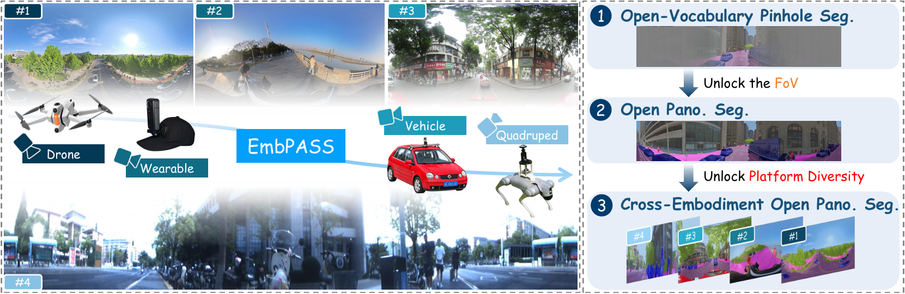

<h1 align="center">
  ✨ &nbsp; EmbPASS &nbsp; ✨
</h1>

<h3 align="center">
  Towards Cross-Embodiment Open Panoramic Segmentation
</h3>

  <em>Open-vocabulary panoramic segmentation across diverse embodied platforms.</em>

  
  
  

  <a href="#overview"><b>🔭 Overview</b></a> &nbsp; · &nbsp;
  <a href="#demo"><b>🎬 Demo</b></a> &nbsp; · &nbsp;
  <a href="#benchmark"><b>🗂️ Benchmark</b></a> &nbsp; · &nbsp;
  <a href="#release-status"><b>🚀 Release Status</b></a>

---

## 🔭 Overview

**EmbPASS** introduces **Cross-Embodiment Open Panoramic Segmentation** for open-vocabulary panoramic perception across heterogeneous embodied platforms.

It establishes a unified benchmark spanning **Vehicle, Drone, Wearable, and Quadruped**, and proposes **EPONet** for panoramic perception under heterogeneous embodied observations.

  

  <em>
    Overview of EmbPASS and cross-embodiment open panoramic segmentation.
  </em>

---

## 🎬 Demo

Panoramic observations from diverse embodied platforms and the corresponding segmentation results.

https://github.com/user-attachments/assets/708122cf-aa37-433e-a688-41ad9ef74df0

---

## 🗂️ Benchmark

**EmbPASS** consists of **1,000 annotated panoramic images** spanning four representative embodied platforms: **Vehicle, Drone, Wearable, and Quadruped**, under a unified semantic taxonomy.

---

## 🚀 Release Status

> 🚧 The EmbPASS benchmark and EPONet source code will be made publicly available.

- [ ] 📚 Release the **EmbPASS benchmark**.
- [ ] 💻 Release the **EPONet source code**.

---

  <a href="#top">⬆ Back to Top</a>

